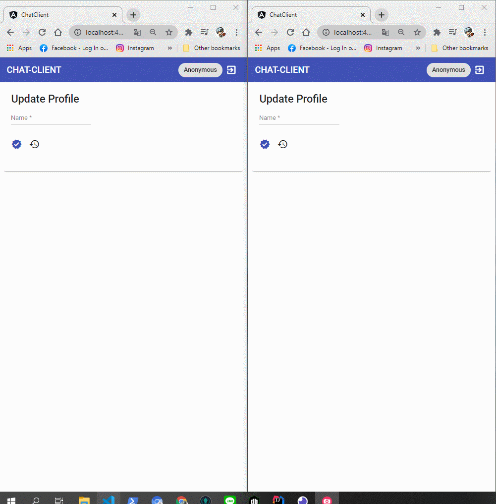

# Chat-Client

An APP about chatting via websocket

[DEMO](https://moonyan.github.io/chat-client)

## Feature

- emit echo message.
- emit broadcast message.
- receive message from server.

## Skill

- [Angular CLI](https://github.com/angular/angular/tree/10.2.x) version 10.2
- [Angular Material](https://v10.material.angular.io/) version 10.2
- [ngx-socket-io](https://github.com/rodgc/ngx-socket-io/tree/v3.2.0) version 3.2
- [Connect Backend](https://github.com/MOONYAN/chat-backend)

## Result

